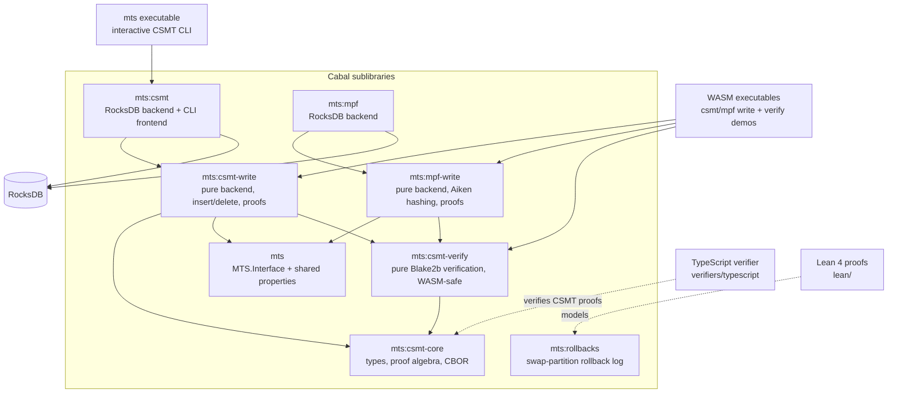

# MTS - Merkle Tree Store

[](https://github.com/lambdasistemi/haskell-mts/actions/workflows/CI.yaml)
[](https://github.com/lambdasistemi/haskell-mts/actions/workflows/deploy-docs.yaml)

Merkle Trees implementation in Haskell with persistent storage and Merkle proofs.

## What is this

MTS is a Haskell library providing a shared interface for authenticated
key-value stores backed by Merkle tries. It ships two implementations:

- **CSMT** - Compact Sparse Merkle Tree: a binary trie with path
  compression, CBOR-encoded inclusion and exclusion proofs, and
  completeness proofs over prefix-grouped subtrees.
- **MPF** - Merkle Patricia Forest: a 16-ary trie over hex nibble keys,
  with root hashes and proof-step encodings compatible with the Aiken
  reference implementation.

Both implementations expose the same mode-indexed `MerkleTreeStore`
GADT. In `Full` mode every mutation updates the trie, and root hash,
inclusion, exclusion, and completeness proofs are available. In
`KVOnly` mode mutations only append to a journal for fast ingest; the
trie is rebuilt later by a parallel journal replay. Feature parity is
enforced by a shared QuickCheck suite: 13 parity properties plus 6
journal/replay properties, each run against both backends.

The repository also contains a generic swap-partition rollback library
(`mts:rollbacks`) whose core algorithms are proved correct in Lean 4
(`lean/`), WASM builds of the pure write/verify paths powering
in-browser demos, and a TypeScript verifier for CSMT proofs.

> **Warning**: This project is in early development and is not production-ready.

## Architecture



## Install

### Release artifacts

Each [GitHub release](https://github.com/lambdasistemi/haskell-mts/releases)
ships Linux x86_64 artifacts for the `mts` CLI: an AppImage, a `.deb`,
an `.rpm`, and a docker image tarball.

```bash
gh release download --repo lambdasistemi/haskell-mts --pattern '*.AppImage'
chmod +x mts-v*.AppImage
./mts-v*.AppImage --version
```

The docker tarball loads as `ghcr.io/paolino/mts/mts`:

```bash
gh release download --repo lambdasistemi/haskell-mts --pattern '*docker*'
docker load < mts-v*-docker.tar.gz
```

### Using Nix

```bash
nix shell nixpkgs#cachix -c cachix use paolino
nix shell github:lambdasistemi/haskell-mts --refresh
```

### Using Cabal

Requires a working Haskell environment and RocksDB development files:

```bash
cabal install
```

## Quickstart

Point the CLI at a database directory and pipe commands in:

```bash
export CSMT_DB_PATH=./mydb
mts <<'EOF'
i key1 value1
q key1
r
EOF
```

```text
AddedKey
hJggAAEBAAEAAQEAAQEAAAEAAQABAQEBAAABAAABAQAAAAFYIBCf1UdGHyJjFT9Ie9m6K1UWWQ67U3o15jkbh4ifOE8RgJggAAEBAAEAAQEAAQEAAAEAAQABAQEBAAABAAABAQAAAAE=
HZ9W8HqKzlkg3M7y1ivUYtAGm1qJ48zRCU8O3+CCf/A=
```

Run `mts` without piping for an interactive session with the same
commands. See the [CLI manual](https://lambdasistemi.github.io/haskell-mts/manual/)
for the full command set.

## Usage

### Library

`MerkleTreeStore` is indexed by mode: KV operations live in the
`MtsKV` record (always available), tree operations in `MtsTree`
(only in `Full` mode). Construct a CSMT-backed store with
`csmtMerkleTreeStore`, here over the in-memory backend:

```haskell
import CSMT.Backend.Pure (emptyInMemoryDB, pureDatabase, runPure)
import CSMT.Hashes (fromKVHashes, hashHashing)
import CSMT.Interface (csmtCodecs)
import CSMT.MTS (csmtMerkleTreeStore)
import Data.IORef (newIORef, readIORef, writeIORef)
import MTS.Interface (MtsKV (..), MtsTree (..), mtsKV, mtsTree)

main :: IO ()
main = do
    ref <- newIORef emptyInMemoryDB
    let run action = do
            db <- readIORef ref
            let (a, db') = runPure db action
            writeIORef ref db'
            pure a
    store <-
        csmtMerkleTreeStore [] run (pureDatabase csmtCodecs)
            fromKVHashes hashHashing
    mtsInsert (mtsKV store) "key" "value"
    mproof <- mtsMkProof (mtsTree store) "key"
    mroot <- mtsRootHash (mtsTree store)
    print (() <$ mproof, () <$ mroot)
```

The first argument is the namespace prefix (`[]` for the root). The
MPF equivalent is `mpfMerkleTreeStore` from `MPF.MTS` with
`fromHexKVAikenHashes`/`mpfHashing` from `MPF.Hashes`. For persistent
storage use `withRocksDB` from `CSMT.Backend.RocksDB` (or
`withMPFRocksDB` from `MPF.Backend.RocksDB`) to obtain the database
handle, as done by the CLI frontend in `CSMT.Frontend.CLI.App`.

Use `fromHexKVAikenHashes` when you want the same hashed key path that
the Aiken-compatible proofs and browser demo use. `fromHexKVHashes`
routes raw key bytes directly to nibbles.

### WASM outputs

The flake exports the combined WASM bundle and the individual modules
(x86_64-linux only):

```bash
nix build .#wasm-artifacts
nix build .#csmt-verify-wasm
nix build .#csmt-write-wasm
nix build .#mpf-verify-wasm
nix build .#mpf-write-wasm
```

It also exports runnable local preview commands for the static demo bundles:

```bash
PORT=8000 nix run .#csmt-verify-wasm-demo
PORT=8001 nix run .#csmt-wasm-write-demo
PORT=8002 nix run .#mpf-wasm-write-demo
PORT=8003 nix run .#docs
```

## Documentation

Full documentation at [lambdasistemi.github.io/haskell-mts](https://lambdasistemi.github.io/haskell-mts/)

Useful entry points:

- [Getting started](https://lambdasistemi.github.io/haskell-mts/installation/)
- [CLI manual](https://lambdasistemi.github.io/haskell-mts/manual/)
- [CSMT WASM verifier demo](https://lambdasistemi.github.io/haskell-mts/wasm-demo/)
- [CSMT WASM write demo](https://lambdasistemi.github.io/haskell-mts/wasm-write-demo/)
- [MPF WASM write demo](https://lambdasistemi.github.io/haskell-mts/wasm-mpf-demo/)

For AI agents, start at [AGENTS.md](AGENTS.md).

## Development

The nix dev shell carries GHC, cabal, just, fourmolu, mkdocs, and the
asciinema tooling:

```bash
nix develop
just build         # cabal build all (tests + benchmarks)
just test          # unit tests; just test "pattern" to filter
just format        # fourmolu + cabal-fmt + nixfmt
just lean          # build the Lean 4 proofs
just serve-docs    # mkdocs live preview
```

`just` lists all recipes. CI runs the build, unit tests, benchmarks,
TypeScript verifier tests, and formatting checks via the flake.

## License

Apache-2.0
