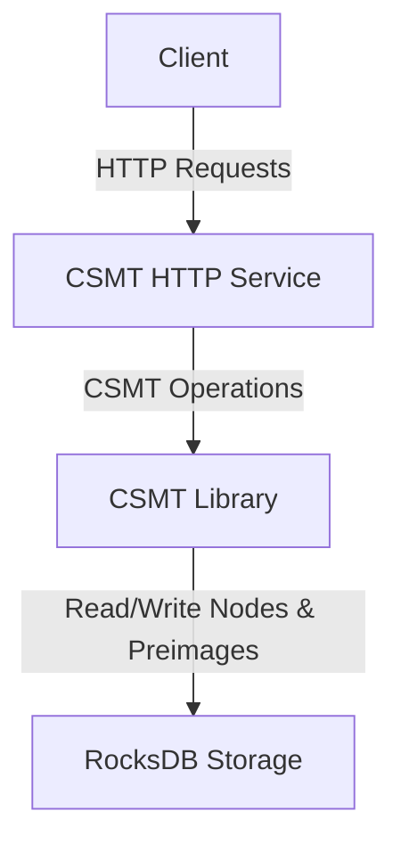

# Architecture

A CSMT instance consists of:
- A RocksDB storage backend for persisting tree nodes and preimages.
- A Haskell library implementing the CSMT data structure and its operations.
- An HTTP service exposing the CSMT functionalities via a RESTful API.

NOTE: The HTTP layer is not done yet.