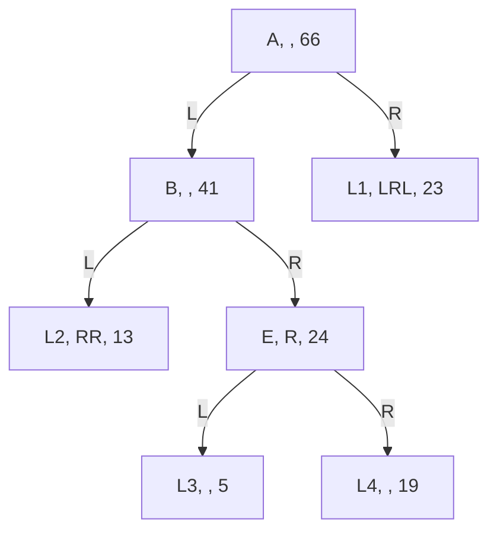

# Example of a CSMT

NOTE: Here we use integers as values and hashes and sum as concatenation.

Mapping keys to values is necessary to include the keys in the hash computation.

For the example we use its binary value directly. Also we map `L` to `0` and `R` to `1` for readability.

Key values:

| Key | Binary | Integer |
| --- | ------ | ------- |
| L   | 0      | 0       |
| R   | 1      | 1       |
| LL  | 00     | 0       |
| LR  | 01     | 1       |
| RL  | 10     | 2       |
| RR  | 11     | 3       |
| LLR | 001    | 1       |
| ... | ...    | ...     |

Let's say we are storing the following facts:

| Key  | Value |
| ---- | ----- |
| LLRR | 13    |
| LRRL | 5     |
| LRRR | 19    |
| RLRL | 23    |

In the database we will have the following entries:

| Reference | Partial Key | Infix | Hashing            | Computation     | Value |
| --------- | ----------- | ----- | ------------------ | --------------- | ----- |
| A         |             |       | _  + B  + L1 + LRL | 0 + 41 + 2 + 23 | 66    |
| B         | L           |       | RR + L2 + R  + E   | 3 + 13 + 1 + 24 | 41    |
| E         | LR          | R     | _  + L3 + _  + L4  | 0 + 19 + 0 + 5  | 24    |
| L2        | LL          | RR    |                    |                 | 13    |
| L3        | LRRL        |       |                    |                 | 5     |
| L4        | LRRR        |       |                    |                 | 19    |
| L1        | R           | LRL   |                    |                 | 23    |

Where the notation is `Reference, Jump, Hash`.

Here we can see that

- Node `A`, at root key, has two children: `B` and `L1`. Because it has no jump the keys of the 2 children `B` and `L1` are just 'L' and 'R'. Moreover its hash is computed by concatenating `B` and `L1` including their jumps
- Node `B`, at key 'L', has two children: `L2` and `E`. Because it has no jump the keys of the 2 children `L2` and `E` are just 'LL' and 'LR'. Moreover its hash is computed by concatenating `L2` and `E` including their jumps
- Node `E`, at key 'LR', has two children: `L3` and `L4`. Because it has jump 'R' the keys of the 2 children `L3` and `L4` are 'LRR' and 'LRR'. Moreover its hash is computed by concatenating `L3` and `L4` including their jumps
- Node `L1` at key 'R' has no children, so its, just pointing to value 23 after jump 'LRL'
- Node `L2` at key 'LL' has no children, so its, just pointing to value 13 after jump 'RR'
- Node `L3` at key 'LRRL' has no children, so its, just pointing to value 5
- Node `L4` at key 'LRRR' has no children, so its, just pointing to value 19