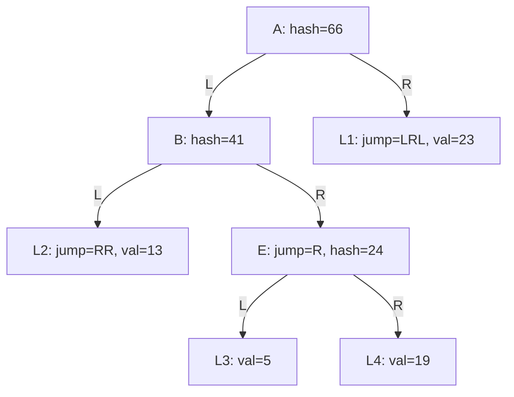

# Worked Example

This example demonstrates how the CSMT stores data and computes hashes,
applying the concepts from [Storage](./storage.md).

## Simplified Hashing

For clarity, we use integers instead of Blake2b-256 hashes:

- **Values**: Plain integers (e.g., 13, 5, 19, 23)
- **Hash combination**: Addition instead of cryptographic hashing
- **Key encoding**: Binary representation (L=0, R=1)


## Input Data

We insert four key-value pairs:

| Key  | Value |
| ---- | ----- |
| LLRR | 13    |
| LRRL | 5     |
| LRRR | 19    |
| RLRL | 23    |

## CSMT Column Storage

The tree is stored with path compression. Each entry has:

- **Path prefix**: The key path to reach this node
- **Jump**: Additional path to skip (path compression)
- **Value/Hash**: Leaf value or computed internal hash

| Node | Path Prefix | Jump | Hash | Computation |
|------|-------------|------|------|-------------|
| A    | []          | -    | 66   | 0 + 41 + 2 + 23 (left child + right child with jumps) |
| B    | [L]         | -    | 41   | 3 + 13 + 1 + 24 |
| E    | [L,R]       | [R]  | 24   | 0 + 5 + 0 + 19 |
| L1   | [R]         | [L,R,L] | 23 | leaf value |
| L2   | [L,L]       | [R,R] | 13 | leaf value |
| L3   | [L,R,R,L]   | -    | 5  | leaf value |
| L4   | [L,R,R,R]   | -    | 19 | leaf value |

## Tree Visualization



## Understanding the Structure

**Leaf nodes (L1, L2, L3, L4)**: Store the actual values. L1 and L2 have jumps
because they're the only nodes in their subtrees (path compression).

**Internal node with jump (E)**: At path `[L,R]` with jump `[R]`. Children are
L3 and L4. Hash computation:
```
E = jump(L3) + hash(L3) + jump(L4) + hash(L4)
  = 0 + 5 + 0 + 19
  = 24
```

**Internal node (B)**: At path `[L]`, children are L2 and E. Hash computation:
```
B = jump(L2) + hash(L2) + jump(E) + hash(E)
  = RR + 13 + R + 24
  = 3 + 13 + 1 + 24
  = 41
```

**Root node (A)**: At path `[]`, children are B and L1. Hash computation:
```
A = jump(B) + hash(B) + jump(L1) + hash(L1)
  = 0 + 41 + LRL + 23
  = 0 + 41 + 2 + 23
  = 66
```

Note: Jump values are converted to integers (L=0, R=1, then binary→decimal).
For example, `LRL` = 010 in binary = 2 in decimal.

## Path Compression in Action

Notice how L1 at path `[R]` has jump `[L,R,L]`. This means the full key `RLRL`
is stored as:

- Path prefix: `[R]` (stored as the database key)
- Jump: `[L,R,L]` (stored in the Indirect value)

Without compression, we'd need intermediate nodes at `[R,L]` and `[R,L,R]`.
The jump eliminates these unnecessary nodes.