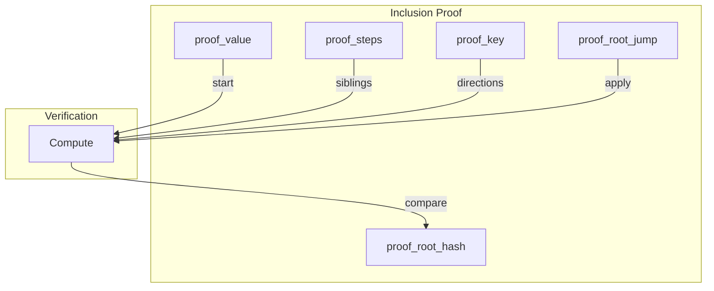

# Inclusion Proof Format

Inclusion proofs allow verifying that a key-value pair exists in a CSMT without
access to the full tree. Proofs are serialized using CBOR for compact,
portable representation.

## Overview

An inclusion proof is self-contained: it includes all information needed to
verify membership, including the key, value hash, and expected root hash.
Verification is pure computation with no database access required.



## CDDL Specification

The proof format is formally specified in CDDL (Concise Data Definition Language):

```cddl
--8<-- "docs/architecture/inclusion-proof.cddl"
```

## Data Types

### Direction

A single bit indicating left (`0`) or right (`1`) in the tree traversal.

```haskell
data Direction = L | R
```

### Key

A path through the tree represented as a list of directions. For Blake2b-256
hashed keys, this is 256 directions (one per bit of the hash).

```haskell
type Key = [Direction]
```

### Indirect

A tree node reference containing:

| Field | Type | Description |
|-------|------|-------------|
| `jump` | `Key` | Path prefix to skip (sparse tree optimization) |
| `value` | `Hash` | Hash value of the node |

```haskell
data Indirect a = Indirect { jump :: Key, value :: a }
```

### ProofStep

Each step in the proof records what's needed to compute one level of the
Merkle tree:

| Field | Type | Description |
|-------|------|-------------|
| `stepConsumed` | `Int` | Key bits consumed: 1 (direction) + length of jump |
| `stepSibling` | `Indirect` | Sibling node for hash combination |

The direction and jump path are **derived from the key** during verification,
not stored in the step. This reduces proof size.

```haskell
data ProofStep a = ProofStep
    { stepConsumed :: Int
    , stepSibling :: Indirect a
    }
```

### InclusionProof

The complete self-contained proof:

| Field | Type | Description |
|-------|------|-------------|
| `proofKey` | `Key` | The key being proven |
| `proofValue` | `Hash` | Hash of the value at the key |
| `proofRootHash` | `Hash` | Expected root hash |
| `proofSteps` | `[ProofStep]` | Steps from leaf to root |
| `proofRootJump` | `Key` | Jump path at the root node |

```haskell
data InclusionProof a = InclusionProof
    { proofKey :: Key
    , proofValue :: a
    , proofRootHash :: a
    , proofSteps :: [ProofStep a]
    , proofRootJump :: Key
    }
```

## Verification Algorithm

Verification recomputes the root hash and compares it to `proofRootHash`:

```
verifyInclusionProof(proof):
    computed = computeRootHash(proof)
    return computed == proof.proofRootHash
```

The `computeRootHash` algorithm:

1. Start with `proofValue` as the current accumulator
2. Compute `keyAfterRoot = drop(length(proofRootJump), proofKey)`
3. **Reverse** `keyAfterRoot` (proof steps are leaf-to-root, key is root-to-leaf)
4. For each step in `proofSteps`:
    - Take `stepConsumed` bits from the reversed key
    - First bit is the **direction**, remaining bits are the **jump**
    - Combine current accumulator with `stepSibling` using the direction:
        - If direction is `L`: `hash(Indirect(jump, acc) || stepSibling)`
        - If direction is `R`: `hash(stepSibling || Indirect(jump, acc))`
    - Result becomes the new accumulator
5. Apply `proofRootJump`: `rootHash(Indirect(proofRootJump, accumulator))`

## Example

Consider a tree with key `[L, R, L]` and value hash `0xabc...`:

```
Tree structure:
    Root (jump=[])
     |
     L
     |
   Node (jump=[])
    / \
   R   L
   |   |
  Leaf Sibling
```

The proof would contain:

```
InclusionProof {
    proofKey = [L, R, L],
    proofValue = 0xabc...,
    proofRootHash = 0xdef...,
    proofSteps = [
        ProofStep { stepConsumed = 1, stepSibling = Indirect [] 0x111... },
        ProofStep { stepConsumed = 1, stepSibling = Indirect [] 0x222... }
    ],
    proofRootJump = []
}
```

Verification:
1. Start with `acc = 0xabc...`
2. Step 1: direction=`L`, combine `acc` with sibling `0x222...` → `acc' = hash(...)`
3. Step 2: direction=`R`, combine `acc'` with sibling `0x111...` → `acc'' = hash(...)`
4. Apply root jump: `rootHash(Indirect [] acc'')`
5. Compare with `proofRootHash`

## Security Considerations

The verifier must independently trust `proofRootHash`. Typical trust sources:

- Blockchain consensus (root hash stored on-chain)
- Trusted third party attestation
- Previous verified state

The proof only demonstrates internal consistency—it cannot prove the root
hash itself is legitimate.
