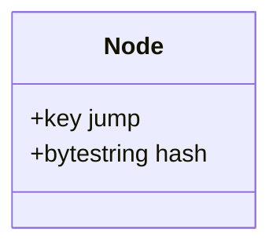
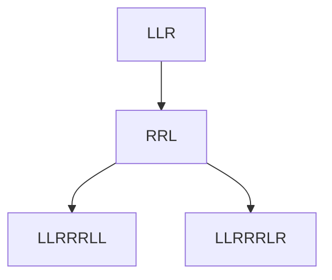

# Storage Layer

The storage layer is responsible for persisting the CSMT nodes and preimages. It uses RocksDB as the underlying storage engine, providing efficient read and write operations.

## CSMT Nodes

CSMT nodes are stored by key prefix and their value is always a combination of a jump (infix) and a hash (either of children nodes or of a value).

This means that just looking at a node content we are not able to distinguish if it is an infix node or a suffix node as they are of the same `type`

### 2 children invariant

In order to distinguish between infix nodes and suffix nodes, we use the following invariants:

- Infix nodes always have 2 children
- Suffix nodes always have 0 children

To query for chilren of node at `LLR` with value `{jump: RRL, hash: _}` we will query for both keys with prefix `LLRRRL`, `LLRRRLL` and `LLRRRLR`. If we find 2 children, then the node is an infix node, otherwise it is a suffix node.

### Hash composition invariant

The hash stored in the node is

- For suffix nodes: the hash of the value
- For infix nodes: the hash of the concatenation of
  - the encoding of node left [^1]
  - the encoding of node right

## Preimages

The preimages of the hashes stored in the CSMT are also stored in RocksDB, allowing for retrieval and verification of the original data associated with each key.

NOTE: Currently the key of the preimages is the preimage of the key of the CSMT node, but this will change with the introduction of grouping feature

[^1]: See [Node encoding](./encodings.md#node-encoding)