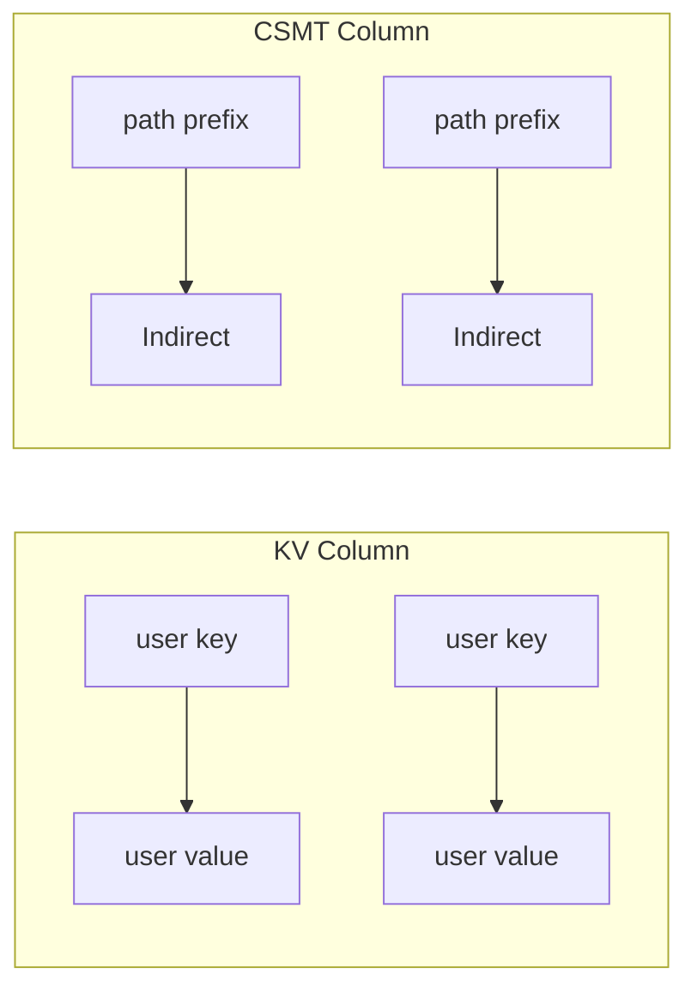
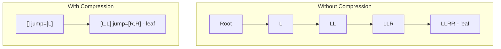

# Storage Layer

The CSMT uses a dual-column storage model with RocksDB as the backend.

## Column Families



| Column | Key Type | Value Type | Purpose |
|--------|----------|------------|---------|
| KV | User key (`k`) | User value (`v`) | Store original key-value pairs |
| CSMT | Path prefix (`Key`) | `Indirect a` | Store Merkle tree nodes |

## CSMT Node Storage

Each node in the CSMT is stored as a key-value pair:

- **Key**: The path prefix (list of directions from root)
- **Value**: An `Indirect` containing:
    - `jump`: Additional path to skip (path compression)
    - `value`: Hash of the node

```haskell
data Indirect a = Indirect
    { jump :: Key      -- Path compression
    , value :: a       -- Hash value
    }
```

### Example

For a tree containing keys `[L,L,R,R]` and `[L,R,R,L]`:

```
CSMT Column:
  []      -> Indirect { jump = [L], value = hash1 }
  [L,L]   -> Indirect { jump = [R,R], value = leafHash1 }
  [L,R]   -> Indirect { jump = [R,L], value = leafHash2 }
```

The root node at `[]` has `jump = [L]` because both keys share the `L` prefix.

## Path Compression

The `jump` field enables path compression. Instead of storing every node along
a path, we store only the nodes where the tree branches, with `jump` indicating
how many levels to skip.



## Preimage Storage (KV Column)

The KV column stores the original key-value pairs, enabling:

- Retrieval of original values given a key
- Proof generation (needs both key and value)
- Value lookup after proof verification

```
KV Column:
  "mykey"   -> "myvalue"
  "another" -> "data"
```

## Hash Composition

The Merkle tree hash is computed using Blake2b-256. The `Hashing` record defines
how hashes are combined:

```haskell
data Hashing a = Hashing
    { rootHash :: Indirect a -> a
    , combineHash :: Indirect a -> Indirect a -> a
    }
```

### Root/Leaf Hash

For a single node (leaf or root), the hash is computed by serializing the
entire `Indirect` structure:

```
rootHash(Indirect{jump, value}) = blake2b(serialize(jump) ++ serialize(value))
```

This means the jump path is **included in the hash**, ensuring path compression
doesn't change the Merkle root.

### Combining Child Hashes

For internal nodes, the parent hash combines both children's `Indirect` values:

```
combineHash(left, right) = blake2b(serialize(left) ++ serialize(right))
```

Both the jump paths and hash values of children contribute to the parent hash.

### Direction-Based Ordering

The `addWithDirection` function determines child ordering based on the
direction taken to reach the current node:

```haskell
addWithDirection hashing L left right = combineHash left right
addWithDirection hashing R left right = combineHash right left
```

- Direction `L`: current node is on the left, sibling on right
- Direction `R`: current node is on the right, sibling on left

## Serialization

Keys and Indirect values are serialized to ByteStrings for storage:

- **Key**: Length (Word16 big-endian) + packed direction bits
- **Indirect**: Serialized key (jump) + length-prefixed hash bytes

See [Encodings](./encodings.md) for the detailed binary format.

## Backend Interface

The storage layer is abstracted through the `Standalone` GADT:

```haskell
data Standalone k v a x where
    StandaloneKVCol   :: Standalone k v a (KV k v)
    StandaloneCSMTCol :: Standalone k v a (KV Key (Indirect a))
```

This allows the same CSMT operations to work with different storage backends
(RocksDB, in-memory, etc.) by providing appropriate codecs.
