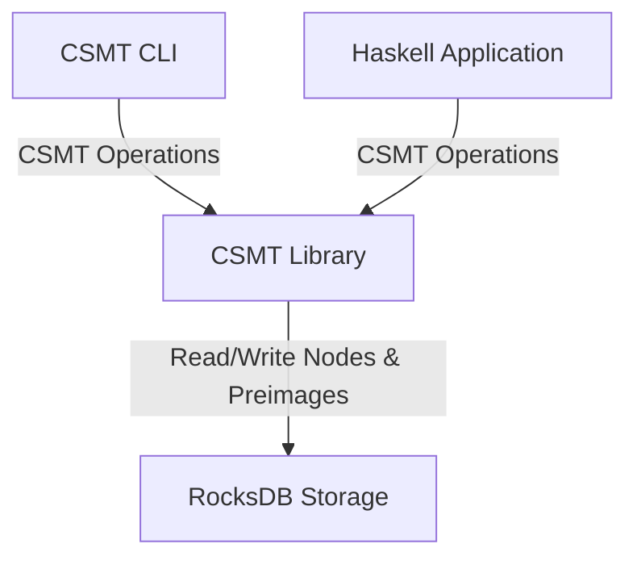
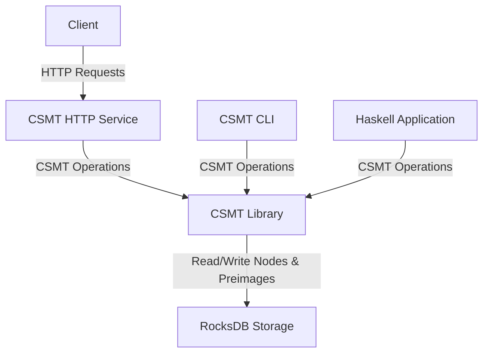

# System Overview

The CSMT system provides multiple interfaces for interacting with the tree.

## Current Architecture

A CSMT instance consists of:

- **RocksDB Storage**: Persistent backend for tree nodes and preimages
- **CSMT Library**: Core Haskell implementation of the data structure
- **CLI Tool**: Interactive command-line interface for tree operations

## Planned Architecture

A future HTTP service will expose the CSMT functionalities via a RESTful API.

