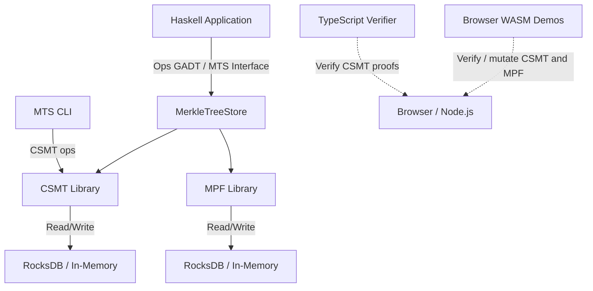

# System Overview

The MTS system provides a shared interface with two trie implementations
and multiple ways to interact with them.

## Architecture

```mermaid
graph TD
    CLI[MTS CLI] -->|CSMT ops| CSMT[CSMT Library]
    App[Haskell Application] -->|Ops GADT / MTS Interface| MTS[MerkleTreeStore]
    MTS --> CSMT
    MTS --> MPF[MPF Library]
    CSMT -->|Read/Write| RDB1[RocksDB / In-Memory]
    MPF -->|Read/Write| RDB2[RocksDB / In-Memory]
    TS[TypeScript Verifier] -.->|Verify CSMT proofs| Client[Browser / Node.js]
    WASM[Browser WASM Demos] -.->|Verify / mutate CSMT and MPF| Client
```

### Layers

| Layer | Description |
|-------|-------------|
| **MTS Interface** | Shared `MerkleTreeStore` GADT with type families. Mode-indexed by `KVOnly` / `Full`. |
| **Ops GADT** | `CommonOps` + `Ops` GADT with bidirectional transitions (`toFull` / `toKVOnly`). |
| **CSMT Implementation** | Binary trie with path compression, CBOR proofs, completeness proofs, CLI, crash recovery. |
| **MPF Implementation** | 16-ary trie with hex nibble keys, batch/streaming inserts, Aiken-compatible hashes, proof-step verification, completeness proofs. |
| **Storage Backends** | RocksDB (persistent) and in-memory (testing) for both implementations. Four columns: KV, Trie, Journal, Metrics. |

### Components

- **MTS Interface** (`MTS.Interface`, `MTS.Properties`): Shared record and
  QuickCheck properties. No storage dependency.
- **CSMT Library** (`mts:csmt`): Binary trie implementation with CLI,
  TypeScript verifier, and completeness proofs.
- **MPF Library** (`mts:mpf`): 16-ary trie implementation with batch inserts
  and Aiken compatibility.
- **CLI Tool** (`mts` executable): Interactive command-line interface for CSMT
  operations. Uses `CSMT_DB_PATH` for the RocksDB database path.
- **TypeScript Verifier** (`@paolino/csmt-verify`): Client-side CSMT proof
  verification for browser/Node.js.
- **Browser WASM demos**: static demos for CSMT read-only verification, CSMT
  write/prove/verify, and MPF write/prove/verify.
- **Rollbacks** (`mts:rollbacks`): a standalone swap-partition rollback log,
  independent of the trie stores, with Lean 4 correctness proofs under
  `lean/`.

## Planned

- HTTP service exposing MTS operations via a RESTful API
