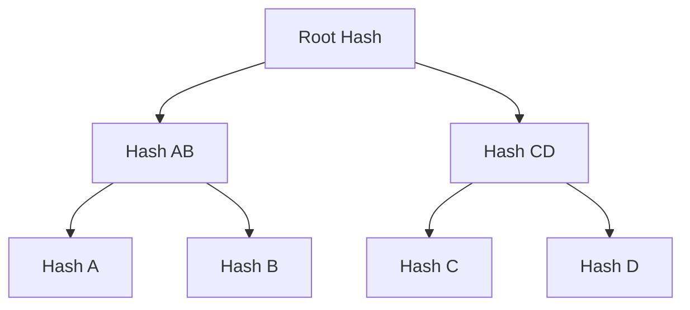

# Concepts

This page explains the key concepts behind Compact Sparse Merkle Trees.

## Merkle Trees

A Merkle tree is a binary tree where:

- Each leaf node contains the hash of a data block
- Each internal node contains the hash of its two children



This structure enables **Merkle proofs** - compact proofs that a specific piece of data is part of the tree. To prove inclusion of data A, you only need:

1. Hash of A
2. Hash B (sibling)
3. Hash CD (uncle)

With these three hashes, anyone can recompute the root and verify the proof.

## Sparse Merkle Trees

A Sparse Merkle Tree (SMT) is a Merkle tree where:

- Keys determine the path through the tree (each bit = left or right)
- Most leaves are empty (hence "sparse")
- The tree depth equals the key length in bits

For a 256-bit key, a naive SMT would have 2^256 possible leaves - far too large to store explicitly.

## Compact Sparse Merkle Trees

A **Compact** SMT optimizes storage by:

1. **Path compression**: Empty subtrees are not stored
2. **Jump paths**: Instead of storing each node on the path, we store a "jump" directly to where the data diverges

### Path Compression Example

Consider inserting keys `LLRR` and `LRRL`:

**Without compression** (naive SMT):
```
Root → L → L → R → R → value1
     ↘ R → R → L → value2
```

**With compression** (CSMT):
```
Root → L (jump to divergence point)
       ├── L,RR → value1  (jump = RR)
       └── R,RL → value2  (jump = RL)
```

The CSMT stores only the nodes where paths actually diverge, plus "jump" metadata indicating how many levels to skip.

## Key Components

### Keys

Keys are represented as sequences of directions (`L` = left = 0, `R` = right = 1). A 256-bit hash becomes a 256-element path through the tree.

### Indirect References

Each node stores an `Indirect` value containing:

- **jump**: The path prefix to skip (path compression)
- **value**: Either a hash (for internal nodes) or the actual value hash (for leaves)

### Hashing

The library uses Blake2b-256 for hashing. Internal node hashes are computed by hashing the concatenation of the encoded left and right children.

## Proofs

### Inclusion Proofs

An inclusion proof demonstrates that a key-value pair exists in the tree. It consists of:

1. The sibling hashes along the path from leaf to root
2. The jump paths at each level

To verify, recompute the root hash from the value and siblings.

### Completeness Proofs

A completeness proof demonstrates that a set of values comprises the entire tree contents. It consists of:

1. All leaf values
2. A sequence of merge operations to reconstruct the tree

## Storage Model

The CSMT uses two storage columns:

| Column | Key | Value |
|--------|-----|-------|
| KV | Original key | Original value |
| CSMT | Path prefix | Indirect (jump + hash) |

This dual storage allows:

- Efficient tree operations via the CSMT column
- Retrieval of original values via the KV column
- Proof generation using both columns
